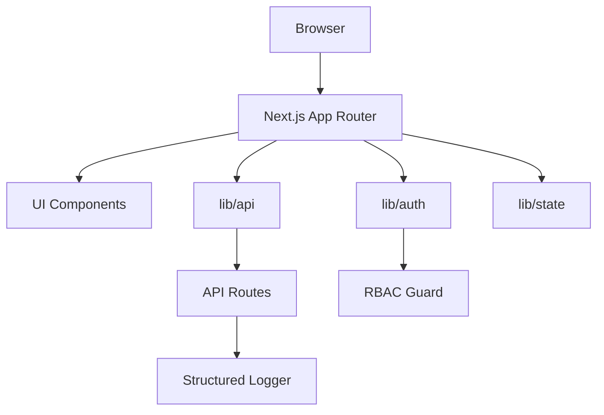

# Axelliant React Enterprise Starter

## Overview
Axelliant React Enterprise Starter is a production-minded Next.js App Router foundation built for real teams. It ships with strict TypeScript, a minimal design system, modern state management, mock authentication with RBAC, structured logging, and a test suite so you can start with momentum instead of scaffolding.

Contact: axelliant.com · info@axelliant.com · security@axelliant.com

## Why this exists
Enterprise projects often spend weeks rebuilding the same plumbing: auth boundaries, state patterns, observability, CI, and documentation. This repo provides those defaults with clean architecture and minimal dependencies, so teams can focus on product value from day one.

## Features
- Next.js App Router with strict TypeScript
- React Query for server state, Zustand for client state
- Mock auth provider + RBAC guard utilities
- Protected routes: `/dashboard` and `/settings`; role-protected `/admin`
- API client pattern with typed endpoints
- Minimal design system: Button, Input, Card
- Structured logging + OpenTelemetry stub
- CI: lint, typecheck, tests, dependency review, Docker build on main
- Docker-ready production image

## Architecture


## Quickstart
```bash
npm install
cp .env.example .env.local
npm run dev
```

Visit:
- `http://localhost:3000/login` to sign in as user or admin
- `http://localhost:3000/dashboard` for the protected dashboard
- `http://localhost:3000/admin` for admin-only access

## Configuration
Environment variables:
- `NEXT_PUBLIC_APP_NAME`: App name shown in UI
- `NEXT_PUBLIC_API_BASE_URL`: Optional API base URL (defaults to same origin)
- `APP_VERSION`: Version reported by `/api/status`
- `AUTH_MODE`: Auth provider selector (set to `mock`)
- `LOG_LEVEL`: `debug | info | warn | error`
- `OTEL_ENABLED`: `true | false` to enable OpenTelemetry stub

All values are documented in `.env.example`.

## API/CLI Usage
API client example:
```ts
import { getStatus } from '@/lib/api/client';

const status = await getStatus();
```

CLI and task runner:
```bash
make setup
make lint
make test
make run
```

## Examples
- React Query usage: `src/app/dashboard/page.tsx`
- Zustand usage: `src/app/settings/page.tsx`
- RBAC guard: `src/lib/auth/rbac.ts` with `/admin` route protection
- API handler: `src/app/api/status/route.ts`

## Testing
```bash
npm run test
```
Includes 3 unit tests and a route-level integration test.

## Deployment (Docker)
```bash
docker build -t axelliant/ax-react-enterprise-starter:latest .
docker run -p 3000:3000 axelliant/ax-react-enterprise-starter:latest
```

## Security Notes
- Mock auth is for local development and MVPs only.
- All sessions are stored in httpOnly cookies.
- Do not log secrets or PII.
- Review `SECURITY.md` for reporting guidelines.

## How to scale this repo
- Swap `lib/auth/mock` with your real identity provider.
- Introduce feature folders under `src/app/(feature)` as the app grows.
- Split `lib/api` by domain and add runtime validation (Zod) if needed.
- Add background jobs or webhooks under `src/app/api` with dedicated modules.
- Add observability exporters when connecting to a telemetry backend.

## Roadmap
- Production auth provider adapters (OIDC, SAML)
- Audit logging and policy enforcement
- Database module with migrations
- UI theme packages and design tokens

## Contributing
See `CONTRIBUTING.md` for guidelines and development workflow.

## License
MIT. See `LICENSE`.
